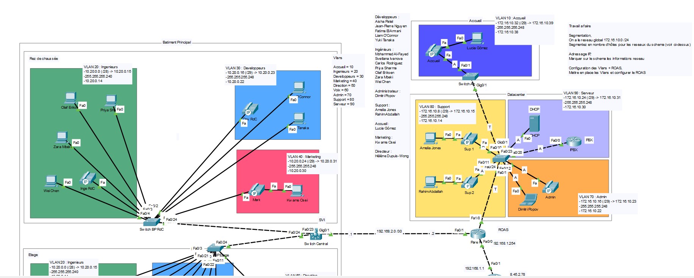
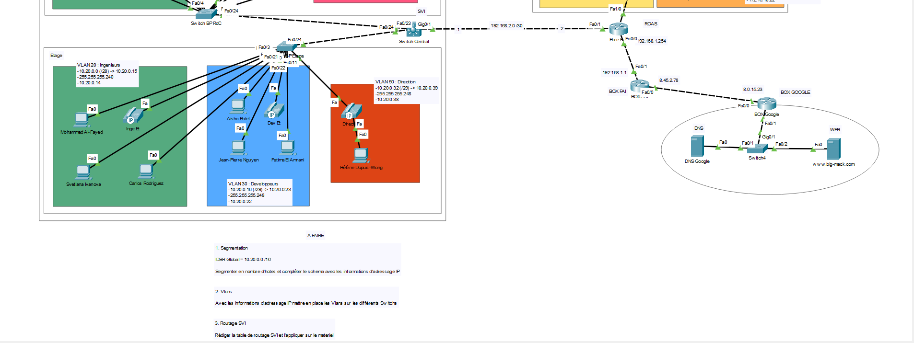

# Projet BigMac — Architecture réseau d'entreprise multi-sites

**Formation :** TSSR (Technicien Systèmes et Réseaux)
**Outil :** Cisco Packet Tracer

## Contexte

Conception et configuration d'une architecture réseau complète pour une entreprise fictive répartie sur deux sites : un **Bâtiment Principal** (rez-de-chaussée + étage) et un **Datacenter**. L'objectif était de partir d'un plan d'adressage global (`10.20.0.0/16` et `172.16.10.0/24`) et de construire un réseau segmenté, routé et sécurisé pour environ 25 utilisateurs répartis en 9 services.

## Objectifs du TP

1. Segmenter l'adressage IP par VLAN (calcul VLSM selon le nombre d'hôtes par service)
2. Mettre en place les VLANs sur l'ensemble des commutateurs
3. Configurer le routage inter VLAN (SVI + Router-on-a-Stick)
4. Déployer la téléphonie IP (VoIP) avec un IPBX
5. Sécuriser l'accès à distance aux équipements (SSH)
6. Simuler la connectivité vers Internet

## Architecture

Le réseau est structuré en 9 VLANs répartis sur deux sites :

| VLAN | Service | Plage réseau |
|---|---|---|
| 10 | Accueil | 172.16.10.32/29 |
| 20 | Ingénieurs | 10.20.0.0/28 |
| 30 | Développeurs | 10.20.0.16/29 |
| 40 | Marketing | 10.20.0.24/29 |
| 50 | Direction | 10.20.0.32/29 |
| 60 / 66 | Voix (téléphonie) | 172.16.10.0/29 et 10.20.0.48/28 |
| 70 / 77 | Administration | 172.16.10.16/29 et 10.20.0.64/29 |
| 80 | Support | 172.16.10.8/29 |
| 90 | Serveur | 172.16.10.24/29 |

**Topologie générale :**

## Compétences techniques mobilisées

- **VLAN & VLSM** : création, nommage, calcul de sous-réseaux à taille variable
- **Trunking 802.1Q** : liaisons trunk entre switches avec restriction des VLANs autorisés (`switch port trunk allowed vlan`)
- **Routage inter VLAN** : deux approches combinées sur un même projet
  - **SVI** (interfaces VLAN routées) sur le Switch Central
  - **Router-on-a-Stick** sur le Pare-feu, avec sous-interfaces `dot1Q` par VLAN
- **VoIP / Téléphonie IP** : configuration d'un IPBX Cisco (`telephony-service`), création de postes (`ephone-dn`), VLAN voix dédié avec `switchport voice vlan`
- **DHCP Relay** : transmission des requêtes DHCP entre sites via `IP helper-address`
- **Sécurisation des accès** : génération de clés RSA, SSH v2, comptes locaux, désactivation de telnet
- **Routage statique** : routes inter-sites et route par défaut vers la sortie Internet simulée

## Difficultés rencontrées et solutions

- **Chevauchement d'adressage** entre le VLAN 50 (Direction) et le VLAN 66 (Voix2) : un espace de 8 adresses a été volontairement laissé vacant entre les deux blocs pour éviter le conflit, plutôt que de refaire tout le plan d'adressage.
- **Cohérence des trunks** : veiller à n'autoriser que les VLANs réellement présents sur chaque liaison trunk, pour limiter le broadcast inutile et éviter les erreurs de configuration silencieuses.

## Fichiers

- `bigmac.pkt` — Simulation Cisco Packet Tracer complète
- `configs-cli.txt` — Extraits de configuration CLI (VLANs, trunks, SVI, ROAS, IPBX, SSH)

---
*Projet réalisé dans le cadre de la formation TSSR. Environnement de simulation (Cisco Packet Tracer) — les identifiants figurant dans les configurations sont fictifs.*
