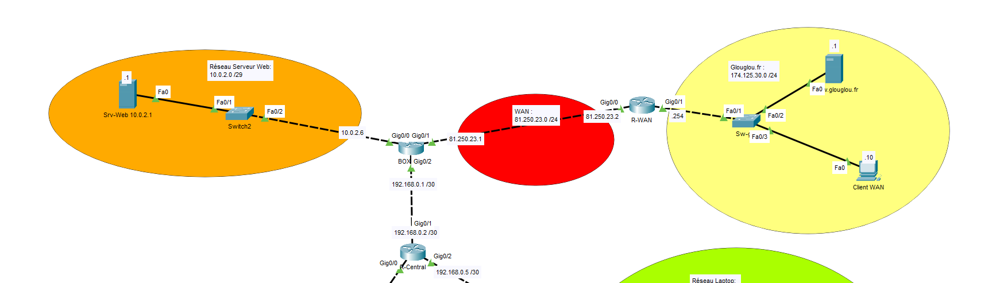
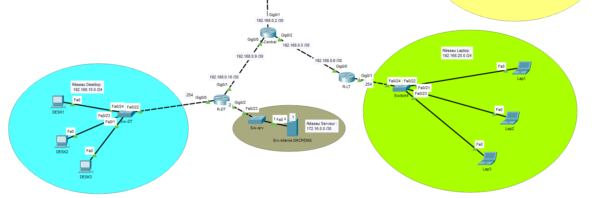

# Projet NAT — Traduction d'adresses réseau (NAT surchargé / PAT)

*Un second projet complémentaire sur le NAT statique et le port forwarding est en préparation pour compléter cette démonstration avec l'exposition ciblée d'un service.*

**Formation :** TSSR (Technicien Systèmes et Réseaux)
**Outil :** Cisco Packet Tracer

## Contexte

Mise en place d'un réseau d'entreprise multi-sites simulant une sortie vers Internet via **NAT dynamique surchargé (PAT — Port Address Translation)**, permettant à plusieurs réseaux internes de partager une seule adresse IP publique pour sortir vers le WAN.

## Objectifs du TP

1. Concevoir une architecture multi-sites avec un routeur central de distribution
2. Configurer le NAT surchargé (overload/PAT) sur le routeur de sortie Internet
3. Restreindre les réseaux autorisés à sortir via une ACL standard
4. Mettre en place le routage statique entre tous les sites
5. Configurer le relais DHCP pour les réseaux utilisateurs
6. Simuler un accès à un service web externe (hors du réseau de l'entreprise)

## Architecture

Le réseau comprend un site "Serveur Web" interne, un cœur de réseau (R-Central) distribuant vers deux sites utilisateurs (Desktop et Laptop), et une sortie Internet simulée (BOX) vers un réseau externe fictif ("glouglou.fr").

**Plan d'adressage :**

| Réseau | Plage | Équipements |
|---|---|---|
| Serveur Web (interne) | 10.0.2.0/29 | Srv-Web (.1), BOX (.6) |
| Liaison BOX ↔ R-WAN (WAN) | 81.250.23.0/24 | BOX (.1), R-WAN (.2) |
| Réseau externe simulé (glouglou.fr) | 174.125.30.0/24 | v.glouglou.fr (.1) |
| Liaison BOX ↔ R-Central | 192.168.0.0/30 | BOX (.1), R-Central (.2) |
| Liaison R-Central ↔ R-DT | 192.168.0.8/30 | R-Central (.9), R-DT (.10) |
| Liaison R-Central ↔ R-LT | 192.168.0.4/30 | R-Central (.5), R-LT (.6) |
| Réseau Desktop | 192.168.10.0/24 | Passerelle R-DT (.254) |
| Réseau Laptop | 192.168.20.0/24 | Passerelle R-LT (.254) |
| Serveur interne DHCP/DNS | 172.16.0.0/30 | R-DT (.2), Srv-interne (.1) |

**Topologie générale :**

## Compétences techniques mobilisées

- **NAT surchargé (PAT)** : traduction de plusieurs adresses internes vers une seule adresse publique via `ip nat inside source list 1 interface GigabitEthernet0/1 overload`
- **ACL standard** : définition des réseaux autorisés à être traduits (`access-list 1 permit ...`) — ici les réseaux Desktop, Laptop et le sous-réseau serveur interne
- **Marquage des interfaces NAT** : distinction claire entre interfaces `ip nat inside` (réseaux internes) et `ip nat outside` (côté WAN)
- **Routage statique multi-sauts** : routes déclarées sur chaque routeur pour joindre les réseaux distants à travers le cœur de réseau R-Central
- **Relais DHCP** (`ip helper-address`) : les réseaux Desktop et Laptop pointent vers un serveur DHCP centralisé situé sur un autre sous-réseau
- **Conception d'architecture hub-and-spoke** : R-Central comme point de convergence entre le site serveur, le site desktop et le site laptop

## Fichiers

- `nat.pkt` — Simulation Cisco Packet Tracer complète
- `configs-cli.txt` — Extraits de configuration CLI (NAT, ACL, routage, DHCP relay)

---
*Projet réalisé dans le cadre de la formation TSSR. Environnement de simulation (Cisco Packet Tracer).*
