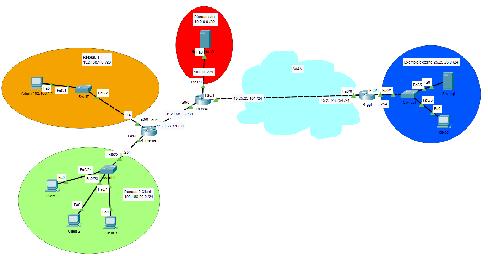

# Projet NAT Statique & Port Forwarding — Publication d'un service web interne

**Formation :** TSSR (Technicien Systèmes et Réseaux)
**Outil :** Cisco Packet Tracer

## Contexte

Ce projet complète le TP NAT surchargé (voir `02-nat`) en démontrant l'usage combiné du **NAT dynamique overload** (pour la navigation sortante des utilisateurs) et du **NAT statique avec redirection de port (port forwarding)** pour publier un serveur web interne sur Internet à travers une IP publique unique.

## Objectifs du TP

1. Concevoir un réseau d'entreprise avec un site IT/Admin, un réseau clients, un serveur web interne et une sortie Internet via pare-feu
2. Configurer le NAT surchargé (PAT) pour la sortie Internet des utilisateurs
3. Configurer le NAT statique avec redirection de port pour exposer le serveur web (port 80) via l'IP publique du pare-feu
4. Mettre en place le routage (statique et RIP) entre les différents sites
5. Simuler un réseau externe (Internet) pour valider l'accessibilité du service publié

## Architecture

Le réseau comprend un **Firewall** en bordure, connecté à trois zones internes (réseau IT/Admin, réseau du serveur web, réseau clients via un routeur interne) et à un réseau externe simulé représentant Internet.

**Plan d'adressage :**

| Réseau | Plage | Détail |
|---|---|---|
| Réseau IT / Admin | 192.168.1.0/28 | Admin (.1), R-Interne (.14) |
| Réseau Site (serveur web interne) | 10.0.0.0/29 | Hb-Web (.1), Firewall Eth1/0 (.6) |
| Liaison R-Interne ↔ Firewall | 192.168.3.0/30 | R-Interne (.1), Firewall (.2) |
| Réseau Clients | 192.168.20.0/24 | Passerelle R-Interne (.254) |
| Liaison Firewall ↔ WAN (R-ggl) | 45.25.23.0/24 | Firewall — côté public (.101), R-ggl (.254) |
| Réseau externe simulé | 25.25.25.0/24 | Srv-ggl, Clt-ggl |

**Topologie générale :**

## Compétences techniques mobilisées

- **NAT overload (PAT)** : sortie Internet mutualisée pour les réseaux Admin, Clients et le sous-réseau serveur, via `ip nat inside source list 1 interface FastEthernet0/1 overload`
- **NAT statique avec port forwarding** : publication ciblée du port 80 du serveur web interne (`10.0.0.1`) via l'IP publique du pare-feu, avec `ip nat inside source static tcp 10.0.0.1 80 45.25.23.101 80`
- **ACL standard** : définition précise des réseaux internes autorisés à sortir (4 sous-réseaux distincts déclarés individuellement)
- **Marquage des interfaces NAT** : `ip nat inside` sur les 3 interfaces internes du pare-feu, `ip nat outside` sur l'interface publique
- **Routage hybride** : routage statique sur le Firewall et le routeur externe (R-ggl), protocole de routage dynamique **RIP** activé sur R-Interne côté réseau local
- **Segmentation par rôle** : séparation claire entre réseau d'administration, réseau serveur exposé, et réseau clients

## Difficultés rencontrées et solutions

*(à compléter — n'hésite pas à me dire quelles difficultés tu as rencontrées sur ce TP)*

## Fichiers

- `portforwarding.pkt` — Simulation Cisco Packet Tracer complète
- `configs-cli.txt` — Extraits de configuration CLI (NAT overload, NAT statique/port forwarding, ACL, routage)

---
*Projet réalisé dans le cadre de la formation TSSR, en complément du TP NAT surchargé. Environnement de simulation (Cisco Packet Tracer).*
