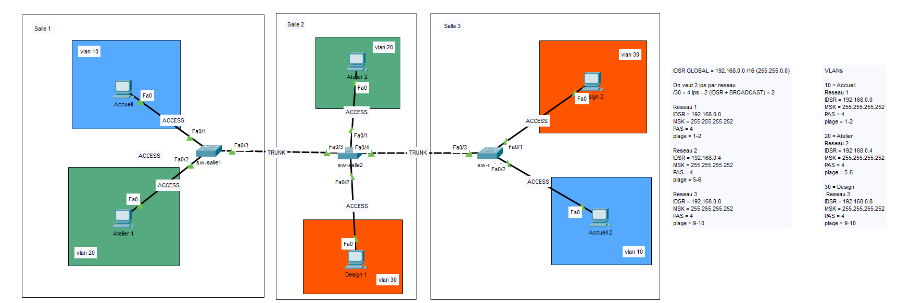

# Projet VLAN Segmentation — Segmentation réseau et calcul d'adressage

**Formation :** TSSR (Technicien Systèmes et Réseaux)
**Outil :** Cisco Packet Tracer

## Contexte

TP de base sur la segmentation réseau par VLAN, associant **calcul d'adressage IP (sous-réseautage)** et **configuration VLAN/trunking** sur trois commutateurs répartis dans trois salles. L'objectif était de partir d'un plan d'adressage global et de le décliner en sous-réseaux minimalistes, un par VLAN.

## Objectifs du TP

1. Calculer des sous-réseaux à partir d'un plan d'adressage global (`192.168.0.0/16`), avec seulement 2 hôtes utiles par réseau
2. Créer et nommer les VLANs sur chaque commutateur
3. Configurer les ports en mode accès (VLAN dédié par poste)
4. Configurer les liaisons trunk entre commutateurs, en limitant chaque trunk aux seuls VLANs réellement nécessaires

## Architecture

Trois salles, chacune équipée d'un commutateur, reliées en chaîne par des liaisons trunk. Chaque VLAN (Accueil, Atelier, Design) est présent dans deux salles différentes, ce qui impose de faire circuler le bon VLAN sur le bon trunk.

**Plan d'adressage (VLSM /30, 2 hôtes utiles par réseau) :**

| VLAN | Service | Réseau | Masque | Plage utile |
|---|---|---|---|---|
| 10 | Accueil | 192.168.0.0/30 | 255.255.255.252 | .1 – .2 |
| 20 | Atelier | 192.168.0.4/30 | 255.255.255.252 | .5 – .6 |
| 30 | Design | 192.168.0.8/30 | 255.255.255.252 | .9 – .10 |

**Répartition des VLANs par salle :**

| Salle / Switch | Ports accès | VLANs autorisés sur les trunks |
|---|---|---|
| Salle 1 (sw-salle1) | Fa0/1 = VLAN 10 (Accueil), Fa0/2 = VLAN 20 (Atelier 1) | Fa0/3 → sw-salle2 : VLAN 10, 20 |
| Salle 2 (sw-salle2) | Fa0/1 = VLAN 20 (Atelier 2), Fa0/2 = VLAN 30 (Design 1) | Fa0/3 → sw-salle1 : VLAN 10, 20 · Fa0/4 → sw-salle3 : VLAN 10, 30 |
| Salle 3 (sw-salle3) | Fa0/1 = VLAN 30 (Design 2), Fa0/2 = VLAN 10 (Accueil 2) | Fa0/3 → sw-salle2 : VLAN 10, 30 |

**Topologie générale :**

## Compétences techniques mobilisées

- **Calcul de sous-réseaux (VLSM)** : dimensionner un réseau au plus juste (masque /30) quand seuls 2 hôtes sont nécessaires
- **Création et nommage de VLANs** (`vlan <id>` / `name <nom>`)
- **Ports en mode accès** : assignation d'un VLAN par port utilisateur (`switchport mode access` / `switchport access vlan`)
- **Trunking 802.1Q avec restriction de VLANs** : chaque trunk n'autorise que les VLANs qui transitent réellement par ce lien (`switchport trunk allowed vlan`), plutôt que de laisser passer tous les VLANs par défaut — bonne pratique pour limiter le broadcast inutile
- **Topologie en chaîne (daisy chain)** : compréhension de la propagation d'un VLAN à travers plusieurs commutateurs successifs quand ce VLAN est présent dans des salles non adjacentes

## Limites du TP

Ce TP reste au niveau 2 (commutation) : aucun routage inter-VLAN n'a été configuré (pas de SVI ni de Router-on-a-Stick), les VLANs sont donc isolés entre eux à ce stade. C'est une base volontairement simple avant d'aborder le routage inter-VLAN (voir le projet BigMac pour la suite logique).

## Difficultés rencontrées et solutions

*(à compléter — n'hésite pas à me dire quelles difficultés tu as rencontrées sur ce TP)*

## Fichiers

- `vlan-segmentation.pkt` — Simulation Cisco Packet Tracer complète
- `configs-cli.txt` — Configuration CLI complète des trois commutateurs

---
*Projet réalisé dans le cadre de la formation TSSR. Environnement de simulation (Cisco Packet Tracer).*
