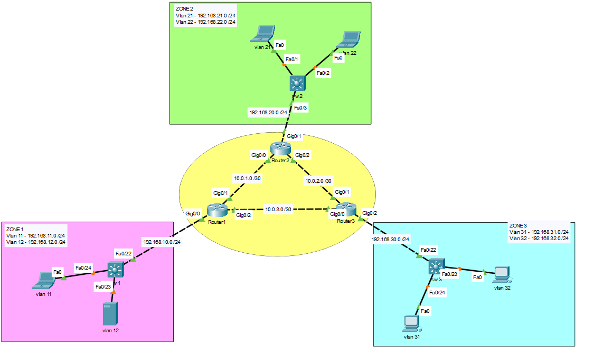

# Projet OSPF — Routage dynamique multi-zones

**Formation :** TSSR (Technicien Systèmes et Réseaux)
**Outil :** Cisco Packet Tracer

## Contexte

Déploiement du protocole de routage dynamique **OSPF (Open Shortest Path First)** en topologie **multi-aires**, sur un réseau composé de trois sites (zones) reliés par un backbone (area 0) formé de trois routeurs en triangle. Chaque site combine un commutateur de niveau 3 (routage inter-VLAN via SVI) et un routeur de bordure faisant l'interface avec le backbone.

## Objectif du TP

Chaque réseau du schéma doit être connu de l'ensemble des équipements de routage, grâce à la propagation automatique des routes par OSPF (par opposition au routage statique où chaque route doit être déclarée manuellement sur chaque équipement).

## Architecture

- **Area 0 (backbone)** : liaisons point-à-point entre R1, R2 et R3, formant un maillage triangulaire
- **Area 1** : Zone 1, rattachée à R1 via Sw1 (VLAN 11, VLAN 12)
- **Area 2** : Zone 2, rattachée à R2 via Sw2 (VLAN 21, VLAN 22)
- **Area 3** : Zone 3, rattachée à R3 via Sw3 (VLAN 31, VLAN 32)

**Plan d'adressage :**

| Zone / Liaison | Réseau | Area OSPF |
|---|---|---|
| Backbone R1 ↔ R2 | 10.0.1.0/30 | 0 |
| Backbone R2 ↔ R3 | 10.0.2.0/30 | 0 |
| Backbone R1 ↔ R3 | 10.0.3.0/30 | 0 |
| Liaison Sw1 ↔ R1 | 192.168.10.0/24 | 1 |
| VLAN 11 (Zone 1) | 192.168.11.0/24 | 1 |
| VLAN 12 (Zone 1) | 192.168.12.0/24 | 1 |
| Liaison Sw2 ↔ R2 | 192.168.20.0/24 | 2 |
| VLAN 21 (Zone 2) | 192.168.21.0/24 | 2 |
| VLAN 22 (Zone 2) | 192.168.22.0/24 | 2 |
| Liaison Sw3 ↔ R3 | 192.168.30.0/24 | 3 |
| VLAN 31 (Zone 3) | 192.168.31.0/24 | 3 |
| VLAN 32 (Zone 3) | 192.168.32.0/24 | 3 |

**Topologie générale :**

## Compétences techniques mobilisées

- **OSPF multi-aires** : conception d'un backbone (area 0) reliant plusieurs aires périphériques, conformément à la règle OSPF selon laquelle toute aire non-backbone doit être directement connectée à l'area 0
- **Attribution d'un router-id explicite** par équipement, pour un diagnostic plus lisible du réseau OSPF
- **Routage inter-VLAN via SVI** sur des commutateurs de niveau 3 (`ip routing` + interfaces VLAN routées)
- **Déclaration de réseaux OSPF avec wildcard mask** (`network <réseau> <wildcard> area <id>`)
- **Conception de topologie maillée** entre routeurs de backbone (chaque routeur du cœur relié aux deux autres)

## Difficultés rencontrées et solutions

*(à compléter — n'hésite pas à me dire quelles difficultés tu as rencontrées sur ce TP)*

## Fichiers

- `ospf.pkt` — Simulation Cisco Packet Tracer complète
- `configs-cli.txt` — Configuration CLI complète (3 commutateurs L3 + 3 routeurs de backbone)

---
*Projet réalisé dans le cadre de la formation TSSR. Environnement de simulation (Cisco Packet Tracer).*
