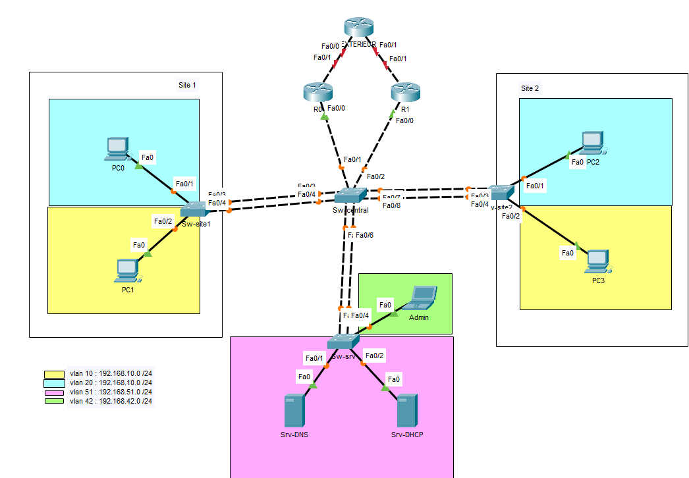

# Projet Agrégation de liens & Redondance de passerelle (EtherChannel + HSRP)

**Formation :** TSSR (Technicien Systèmes et Réseaux)
**Outil :** Cisco Packet Tracer

## Contexte

Conception d'un réseau multi-sites avec un commutateur central agrégeant les liaisons vers deux sites utilisateurs et un site serveur, et deux routeurs en redondance de passerelle (HSRP) pour garantir la continuité de service en cas de panne de l'un des deux.

## Objectifs du TP

1. Agréger les liens physiques entre commutateurs pour augmenter la bande passante et la tolérance aux pannes (EtherChannel / LACP)
2. Mettre en place une passerelle redondante pour chaque VLAN via HSRP, avec un routeur actif et un routeur de secours
3. Configurer le relais DHCP pour les réseaux utilisateurs
4. Vérifier la bascule automatique de la passerelle en cas de panne du routeur actif

## Architecture

Un commutateur central (**Sw-central**) agrège, via des **EtherChannels de 2 liens chacun**, les connexions vers **Sw-site1**, **Sw-site2** et **Sw-srv**. Il est ensuite relié individuellement (liens trunk simples, non agrégés) aux deux routeurs de passerelle **R0** et **R1**, qui assurent la redondance HSRP pour l'ensemble des VLANs.

**Plan d'adressage :**

| VLAN | Usage | Réseau |
|---|---|---|
| 10 | Site 1 / Site 2 (PC1, PC3) | 192.168.10.0/24 |
| 20 | Site 1 / Site 2 (PC0, PC2) | 192.168.10.0/24 *(voir note ci-dessous)* |
| 42 | Admin | 192.168.42.0/24 |
| 51 | Serveurs (DNS, DHCP) | 192.168.51.0/24 |

> **Note :** la légende du schéma indique la même plage (192.168.10.0/24) pour les VLANs 10 et 20 — il s'agit probablement d'une coquille sur le schéma, le VLAN 20 utilisant en réalité une plage différente (à vérifier/corriger, par exemple 192.168.20.0/24, ce qui correspond d'ailleurs à l'adressage réellement configuré sur les interfaces de R0/R1).

**Topologie générale :**

## Compétences techniques mobilisées

- **EtherChannel (LACP, mode active)** : agrégation de 2 liens physiques en un lien logique unique (`channel-group <n> mode active`), sur 4 groupes distincts (Sw-site1 ↔ Sw-central, Sw-site2 ↔ Sw-central, Sw-srv ↔ Sw-central)
- **Configuration du trunk sur l'interface Port-channel** plutôt que sur les interfaces physiques individuelles, avec restriction aux VLANs nécessaires par liaison
- **HSRP (Hot Standby Router Protocol)** : un groupe HSRP par VLAN, avec une adresse IP virtuelle partagée (`standby <groupe> ip`) servant de passerelle commune
- **Bascule maîtrisée** : priorité renforcée sur le routeur principal (`standby <groupe> priority 110`) et activation de la reprise automatique (`standby <groupe> preempt`) pour qu'il redevienne actif dès qu'il revient en service
- **Sous-interfaces routées (Router-on-a-Stick)** sur R0 et R1, une sous-interface 802.1Q par VLAN
- **DHCP Relay** (`ip helper-address`) vers le serveur DHCP, configuré sur les VLANs utilisateurs uniquement
- **Trunks multi-VLANs sur liaisons non agrégées** entre Sw-central et les deux routeurs, transportant l'ensemble des VLANs (10, 20, 42, 51)

## Difficultés rencontrées et solutions

*(à compléter — n'hésite pas à me dire quelles difficultés tu as rencontrées sur ce TP)*

## Fichiers

- `aggregation-redondance.pkt` — Simulation Cisco Packet Tracer complète
- `configs-cli.txt` — Configuration CLI complète (4 commutateurs + 2 routeurs HSRP)

---
*Projet réalisé dans le cadre de la formation TSSR. Environnement de simulation (Cisco Packet Tracer).*
